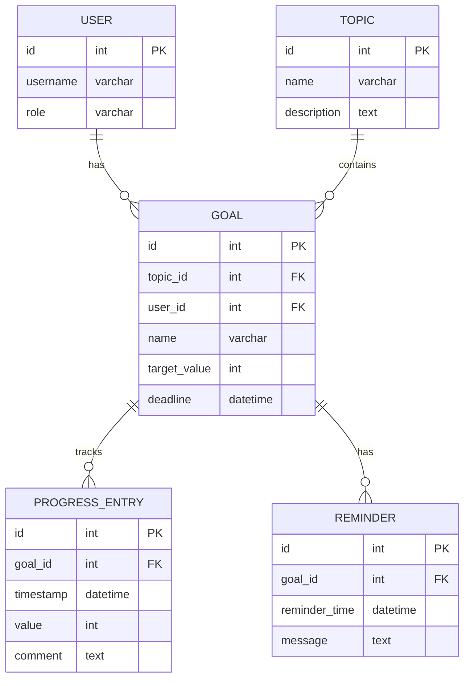

# Вариант 14 — Ключевые сущности, связи и API (эскиз)

Сущности (основные)

- User
  - id: UUID
  - username: string (unique)
  - password_hash: string
  - role: enum [admin, user]

- Topic
  - id: UUID
  - name: string
  - description: string
  - created_at: datetime

- Goal
  - id: UUID
  - topic_id: reference -> Topic.id
  - user_id: reference -> User.id
  - name: string
  - description: string
  - target_value: number
  - deadline: datetime

- ProgressEntry
  - id: UUID
  - goal_id: reference -> Goal.id
  - timestamp: datetime
  - value: number
  - comment: string

Связи (ER-эскиз)

- Topic 1..* Goal (тема имеет цели)
- User 1..* Goal (пользователь имеет цели)
- Goal 1..* ProgressEntry (цель имеет записи прогресса)

Обязательные поля и ограничения (кратко)

- unique(User.username)
- Topic.name not null
- Goal.topic_id → Topic.id (FK, not null)
- Goal.user_id → User.id (FK, not null)
- ProgressEntry.goal_id → Goal.id (FK, not null)

API — верхнеуровневые ресурсы и операции

- /users
  - GET /users (admin)
  - POST /users (admin)
  - GET /users/{id}
  - PUT /users/{id}
  - DELETE /users/{id}

- /topics
  - GET /topics (list)
  - POST /topics (admin)
  - GET /topics/{id}
  - PUT /topics/{id} (admin)
  - DELETE /topics/{id} (admin)

- /goals
  - GET /goals (filter by user, topic)
  - POST /goals (admin)
  - GET /goals/{id}
  - PUT /goals/{id} (admin or owner)
  - DELETE /goals/{id} (admin)

- /progress
  - POST /progress (create entry)
  - GET /progress?goal_id=&from=&to=&limit=&offset=
  - GET /progress/{id}
  - PUT /progress/{id}
  - DELETE /progress/{id}

- /reports
  - GET /reports/user/{id}?from=&to= (statistics)
  - GET /reports/topic/{id}?from=&to= (topic summary)

Дополнительно (бонусы)

- Напоминания: /reminders (CRUD для настройки уведомлений)
- Геймификация: бейджи, достижения за выполнение целей
- Документация API (OpenAPI/Swagger)
- Тесты: unit + интеграционные

---

## Подробные операции API, схемы и поведение

Общие принципы

- Ответы в формате: `{ "status": "ok" | "error", "data"?: ..., "error"?: {code, message, fields?} }`
- Пагинация: `limit` и `offset` (по умолчанию limit=50).
- Аутентификация: `Authorization: Bearer <jwt>`; роли: `admin`, `user`.

Примеры ошибок (JSON)

```json
{
  "status": "error",
  "error": { "code": "validation_failed", "message": "Validation failed", "fields": { "name": "required" } }
}
```

Auth

- POST `/auth/register` — `{email, password, name}` → `201 {id, email, name, role}`
- POST `/auth/login` — `{email, password}` → `200 {accessToken, refreshToken, user}`
- POST `/auth/refresh` — `{refreshToken}` → `200 {accessToken}`

Users

- GET `/users?limit=&offset=` — Admin
- GET `/users/{id}` — Admin или self
- POST `/users` — Admin (payload: `{username,email,password,role?}`)
- PUT `/users/{id}` — Admin или self (частичное обновление)
- DELETE `/users/{id}` — Admin

Topics

- GET `/topics?limit=&offset=` — список тем
- POST `/topics` — Admin (payload: `{name,description}`)
- GET `/topics/{id}` — детали темы, включает список целей
- PUT `/topics/{id}` — Admin
- DELETE `/topics/{id}` — Admin

Goals

- POST `/goals` — Admin `{topicId, userId, name, description, targetValue, deadline}` → `201 {id}`
- GET `/goals?userId=&topicId=` — список целей
- GET `/goals/{id}` — детали цели, включает прогресс
- PUT `/goals/{id}` — Admin или owner
- DELETE `/goals/{id}` — Admin

Progress (записи прогресса)

- POST `/progress` — создание записи

  - Payload (пример):

  ```json
  {
    "goalId": "goal-uuid",
    "timestamp": "2025-10-13T10:00:00Z",
    "value": 10,
    "comment": "Выполнено 10 задач"
  }
  ```

  - Response: `201 {id, goalId, timestamp, value, comment}`

- GET `/progress?goalId=&from=&to=&limit=&offset=` — список записей прогресса

Reports (отчёты)

- GET `/reports/user/{userId}?from=&to=` — статистика пользователя

  - Response: `{userId, totalGoals, completedGoals, progressPercentage, topicsSummary: [{topicId, topicName, goalsCount, completedCount}]}`

- GET `/reports/topic/{topicId}?from=&to=` — статистика по теме

  - Response: `{topicId, topicName, totalGoals, completedGoals, usersSummary: [{userId, username, goalsCount, completedCount}]}`

Reminders (бонус)

- POST `/reminders` — создать напоминание `{goalId, reminderTime, message}`
- GET `/reminders?userId=` — список напоминаний пользователя
- DELETE `/reminders/{id}` — удалить напоминание

---

## ERD (диаграмма сущностей)

Mermaid-диаграмма (если рендер поддерживается):



ASCII-эскиз (если mermaid не рендерится):

```text
User 1---* Goal *---1 Topic
              |
              1
              |
              *
         ProgressEntry
```

---

AC — критерии приёмки для функционала диаграмм (MVP)

- AC1: При добавлении ProgressEntry обновляется процент выполнения Goal.
- AC2: GET `/reports/user/{id}` возвращает диаграммы прогресса с визуализацией.
- AC3: Диаграммы отображают прогресс по времени и по целям.
