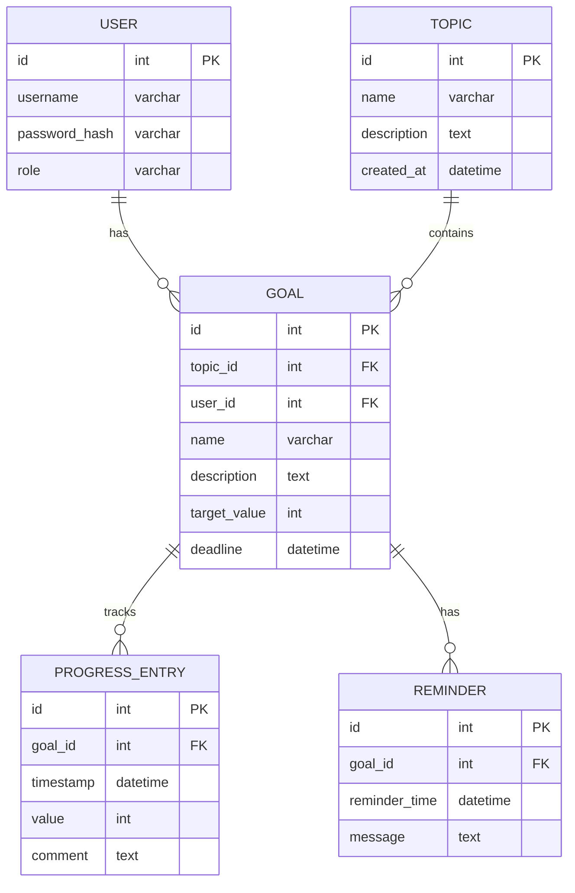

# Вариант 14 — ERD (диаграмма сущностей) — Прогресс «До сессии успею»

Файл содержит: 1) mermaid-диаграмму ERD; 2) ASCII-эскиз; 3) минимальный SQL DDL-скетч для создания таблиц.

## Mermaid ERD



## ASCII-эскиз

```
User 1---* Goal *---1 Topic
              |
              1
              |
              *
         ProgressEntry
              |
              1
              |
              *
          Reminder
```

## Минимальный SQL DDL (пример, PostgreSQL)

```sql
CREATE TABLE users (
 id UUID PRIMARY KEY,
 username TEXT UNIQUE NOT NULL,
 password_hash TEXT NOT NULL,
 role TEXT NOT NULL CHECK (role IN ('admin','user'))
);

CREATE TABLE topics (
 id UUID PRIMARY KEY,
 name TEXT NOT NULL,
 description TEXT,
 created_at TIMESTAMP WITH TIME ZONE DEFAULT now()
);

CREATE TABLE goals (
 id UUID PRIMARY KEY,
 topic_id UUID NOT NULL REFERENCES topics(id) ON DELETE CASCADE,
 user_id UUID NOT NULL REFERENCES users(id) ON DELETE CASCADE,
 name TEXT NOT NULL,
 description TEXT,
 target_value INTEGER NOT NULL,
 deadline TIMESTAMP WITH TIME ZONE
);

CREATE TABLE progress_entries (
 id UUID PRIMARY KEY,
 goal_id UUID NOT NULL REFERENCES goals(id) ON DELETE CASCADE,
 timestamp TIMESTAMP WITH TIME ZONE NOT NULL,
 value INTEGER NOT NULL,
 comment TEXT
);

CREATE TABLE reminders (
 id UUID PRIMARY KEY,
 goal_id UUID NOT NULL REFERENCES goals(id) ON DELETE CASCADE,
 reminder_time TIMESTAMP WITH TIME ZONE NOT NULL,
 message TEXT
);
```
